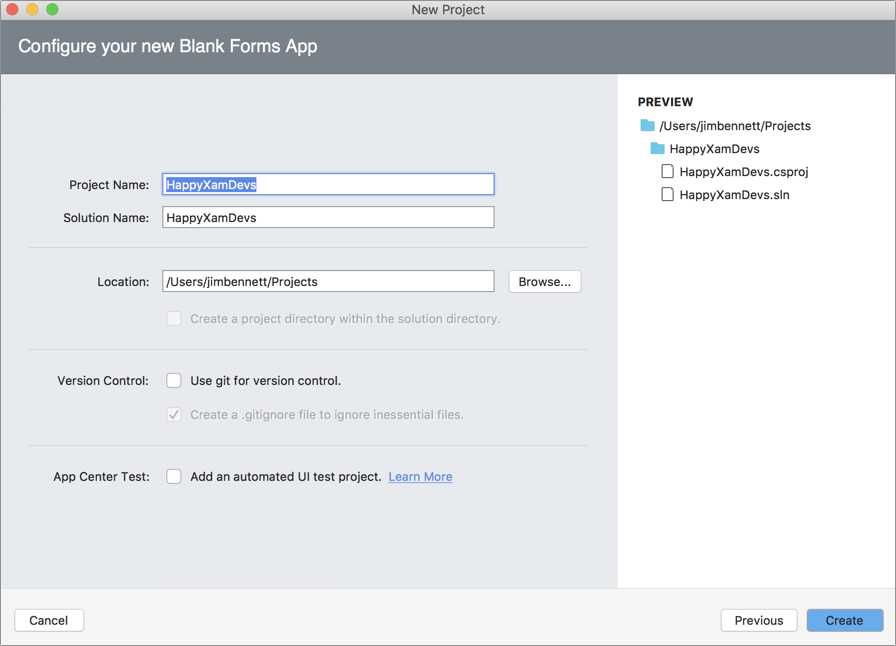

# Creating the solution

Let's begin by creating a cross-platform Xamarin.Forms app.

## 1a. Creating the solution using Visual Studio 2017 on Windows

[Build your first Xamarin.Forms App, Visual Studio 2017](https://docs.microsoft.com/xamarin/get-started/first-app/?pivots=windows)

1. On the  **Get Started** page, select **Create new project...**

2. In the **New Project** dialog, choose **Visual C#** > **Cross-Platform** from the tree on the left

3. Select **Mobile App (Xamarin.Forms)**

4. Enter a project name such as **HappyXamDevs**

5. Choose a location for the solution

    > **Recommended** : Choose a directory close to the root folder of a drive (such as `C:\Code`). Windows limits the length of the file path and the compiler-generated files and directory paths can get very long

6. Click **OK**

7. On the **New Cross Platform App** dialog, select the following:

    - **Select a Template**
        - **Blank App**
    - **Platform**
        - **Android**
        - **Windows (UWP)**
    - **Code Sharing Strategy**
        - **.NET Standard**
  
8. Click **OK**

## 1b. Creating the solution using Visual Studio for Mac

[Build your first Xamarin.Forms App, Visual Studio for Mac](https://docs.microsoft.com/xamarin/get-started/first-app/?pivots=macos)

1. On the **Get Started** page, select **New project**

2. Choose **Multiplatform** > **App**

3. Select **Xamarin.Forms** > **Blank Forms App**

4. Click **Next**

   

5. Make the following selections:

    - **App Name**: **HappyXamDevs**
    - **Organization Identifier**: **com.companyname**

    > **Note**: If will run the app on a physical iOS device using an existing Apple developer account, enter your own domain (e.g. if you own MyCoolDomain.com, enter `com.mycooldomain`)

    - **Target Platforms**
        - iOS
        - Android
    - **Shared Code**
        **.NET Standard**

6. Click **Next**

   

7. Enter the location for your project

8. Click **Create**

   

## 4. Explore the project

This solution contains 3 projects on Mac, and 4 on Windows.

| Project     | Description |
|-------------|-------------|
| **HappyXamDevs** | The .NET Standard shared code project. This project is shared between all the target platforms and is where most of your code and the user interface files (XAML) will go. |
| **HappyXamDevs.Android** | The Xamarin.Android project which generates the Android-specific binary package to be deployed onto Android devices. |
| **HappyXamDevs.iOS** | The Xamarin.iOS project which generates the iOS-specific binary package to be deployed onto iPhone and iPad devices. |
| **HappyXamDevs.UWP** | The Universal Windows project which can be run on Windows 10 devices. This project is only available when you create the solution with Visual Studio on Windows. |

## 5. Build & Run

Build and run each app to see them all working, using the steps in the [setup guide](../SETUP.md).

> **Note:** On Windows you won't be able to run the iOS app unless you are connected to a [Mac build server](https://docs.microsoft.com/xamarin/ios/get-started/installation/windows/connecting-to-mac/?WT.mc_id=mobileappsoftomorrow-workshop-jabenn).

> **Note:** On macOS you won't be able to build and run the UWP project, but this project won't be present if the solution was created with Visual Studio for Mac.

## 4. Next step

Now you have your Xamarin app solution, the next step is to [set up an Azure Functions app](./2-SetupAzureFunctions.md).