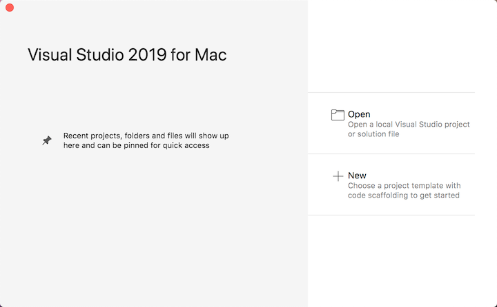
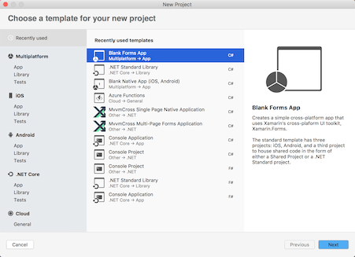
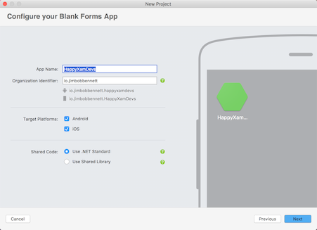
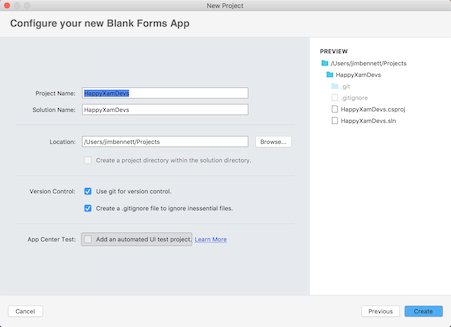
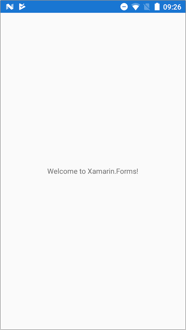

# Creating the solution

Let's begin by creating a new cross-platform Xamarin.Forms app. Clone this repository, or download the Zip file as you will need some image files from this repo later.

## 1. Create a new Xamarin Forms project

### PC

1. Launch Visual Studio 2019

### Mac

1. Launch Visual Studio for Mac
2. Select **+ New** from the **Getting Started** dialog

   

3. Select **Multiplatform->App->Blank Forms App**
4. Ensure the language drop down is set to **C#**

   

5. Click **Next**
6. Name the project **HappyXamDevs**, leave the organization identifier as it is, ensure **iOS** and **Android** are both ticked, and that the **Shared code** option is set to **Use .NET Standard Library**

   

7. Click **Next**
8. Leave the project and solution name as **HappyXamDevs**, and select a suitable location for the project.
9. Unselect the **App Center Test->Add an automated UI test project** option.
    
    

10. Click **Create**

## 2. Explore the project

This solution contains 4 projects on Windows, 3 on macOS.

| Project     | Description |
|-------------|-------------|
| **HappyXamDevs** | The .NET Standard shared code project. This project is shared between all the target platforms and is where most of your code and the user interface files (XAML) will go. |
| **HappyXamDevs.Android** | The Xamarin.Android project which generates the Android-specific binary package to be deployed onto Android devices. |
| **HappyXamDevs.iOS** | The Xamarin.iOS project which generates the iOS-specific binary package to be deployed onto iPhone and iPad devices. |
| **HappyXamDevs.UWP** | The Universal Windows project which can be run on Windows 10 devices. This project is only available when you create the solution with Visual Studio on Windows. |

## 3. Build & Run

Build and run each app to see them all working, using the steps in the [setup guide](../SETUP.md).

> **Note:** On Windows you won't be able to run the iOS app unless you are connected to a [Mac build server](https://docs.microsoft.com/xamarin/ios/get-started/installation/windows/connecting-to-mac/?WT.mc_id=mobileappsoftomorrow-workshop-jabenn).

> **Note:** On macOS you won't be able to build and run the UWP project, so remove this project if you haven't done so already.

## 4. Next step

Now you have your Xamarin app solution, the next step is to [set up an Azure Functions app](./2-SetupAzureFunctions.md).
