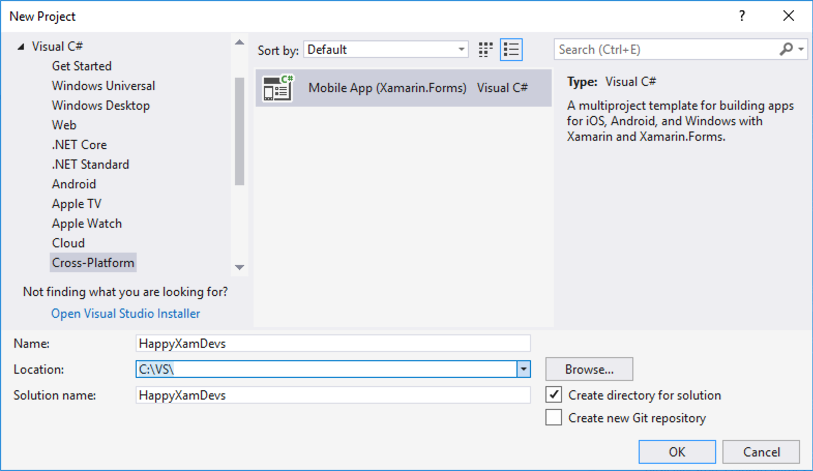
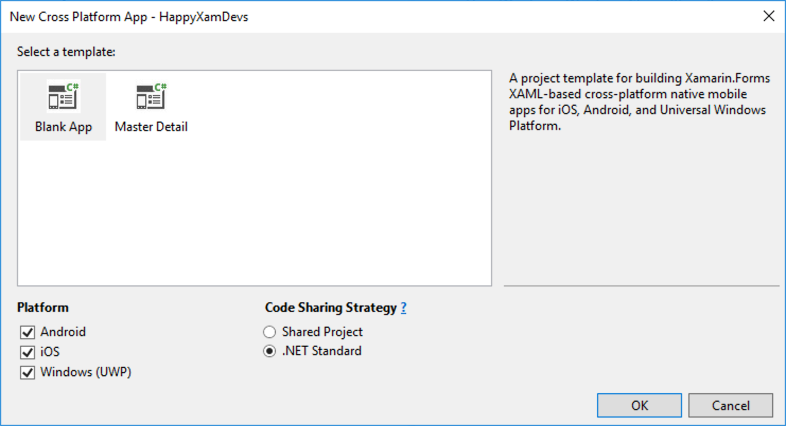
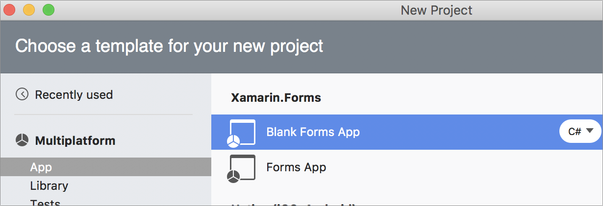
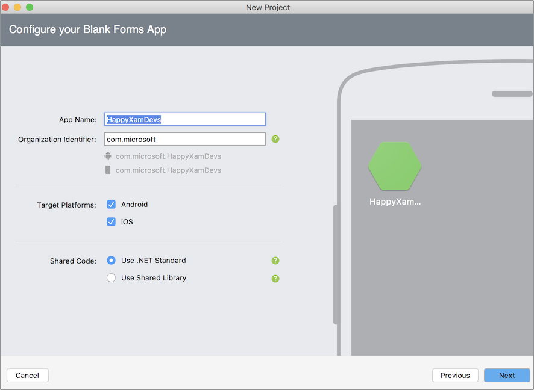

# Creating the solution

You will start by creating a cross-platform Xamarin.Forms app.

## Creating the solution using Visual Studio 2017 on Windows

1. Select "Create new project..." from the _Get Started_ page, or select _File->New->Project..._.

2. In the _New Project_ dialog, choose _Visual C#->Cross-platform_ from the tree on the left, then select _Mobile App (Xamarin Forms)_.

3. Enter a project name such as __HappyXamDevs__, and choose a location for the files. Then click "OK".

    > __Important__ : When building Android apps the paths can get very long inside the `obj` output directory, so place the project somewhere near the root of a drive (such as `C:\Projects`) instead of the default Visual Studio projects path.

   

4. From the _New Cross Platform App_ dialog, select _Blank App_, tick the platforms you want to support (to support iOS you will need network access to a Mac which may not be available if you are in a group workshop). Make sure __.NET Standard__ is selected for the _Code Sharing Strategy_, then click "OK".

   

## Creating the solution using Visual Studio for Mac

1. Select "New project" from the _Get Started_ page, or select _File->New Solution..._.

2. Choose _Multiplatform->App_ from the tree on the left, then select _Xamarin.Forms->Blank Forms App_, then click "Next".

   

3. Enter a name for your app, such as __HappyXamDevs__, then enter an organization identifier. You can leave this as __com.companyname__ unless you are planning to run the app on a physical iOS device using an existing Apple developer account, in which case enter an organization identifier for your own domain in reverse format (e.g. if you own MyCoolDomain.com, enter com.mycooldomain).

4. Ensure both iOS and Android are checked, and that _Shared Code_ is set to __.NET Standard__, then click "Next".

   

5. Choose a location for your project, then click "Create".

   

## Update NuGet packages

The app templates are set up using a fixed version of some NuGet packages (for example Xamarin Forms). To ensure you have the latest bug fixes and functionality, upgrade the NuGet packages to the latest stable versions.

* On Visual Studio 2017 on Windows, right-click on the __HappyXamDevs__ solution in the solution explorer, select _Manage NuGet packages for solution..._, head to the _Updates_ tab, check the _Select all packages_ box and click "Update".

* On Visual Studio for Mac, right-click on the __HappyXamDevs__ solution in the solution explorer and select _Update packages_.

## Explore the project

The new solution will contain 3 projects on Mac, and 4 on Windows.

| Project     | Description |
|-------------|-------------|
| **HappyXamDevs** | The .NET Standard shared code project. This is shared between all the target platforms and is where most of your code and the user interface files (XAML) will go. |
| **HappyXamDevs.Android** | The Xamarin.Android project which generates the Android-specific binary package which can be deployed and run on Android devices. |
| **HappyXamDevs.iOS** | The Xamarin.iOS project which generated the iOS-specific binary package which can be run on iPhone and iPad devices. |
| **HappyXamDevs.UWP** | The Universal Windows project which can be run on Windows 10 devices. This project is only available when you create the solution with Visual Studio on Windows. |

Build and run each app to see them all working, using the steps in the [setup guide](../SETUP.md). From Windows you won't be able to run the iOS app unless you are connected to a [Mac build server](https://docs.microsoft.com/xamarin/ios/get-started/installation/windows/connecting-to-mac/?WT.mc_id=mobileappsoftomorrow-workshop-jabenn). On macOS you won't be able to build and run the UWP project, but this project won't be present if the solution was created with Visual Studio for Mac.

## Next step

Now you have your Xamarin app solution, the next step is to [set up an Azure Functions app](./2-SetupAzureFunctions.md).