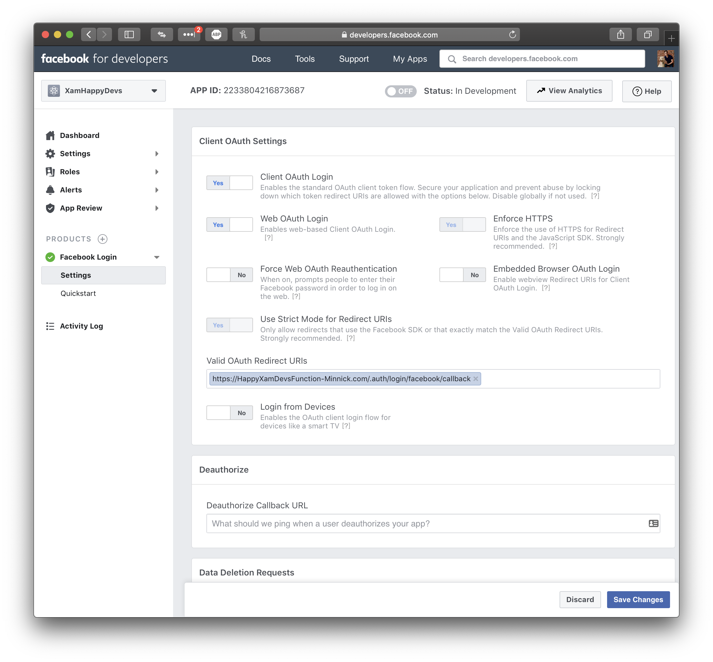

# Set up an Azure Functions app

For this app, we will create our back-end using Azure Functions.

This back-end will use Facebook authentication, meaning that any calls to our Azure Function will only be permitted from authenticated users.

## 1. Create the Functions app in the Azure portal

1. In your browser, navigate to the [Azure portal](https://portal.azure.com/?WT.mc_id=mobileappsoftomorrow-workshop-jabenn)

2. In the Azure Portal, on the left-hand toolbar, click **+ Create a resource**  

    > **Note:** If the toolbar is collapsed, it will be shown as a green **+**

3. In the **Search the marketplace** box, type **Function app**  

4. On your keyboard, tap the **Return** key

5. In the search results, select **Function App**

   

6. At the bottom of the **Function App** window, click **Create**

7. In the **Function App** window, enter the following:

    - **App Name**: HappyXamDevsFunction-[Your Last Name]
      - E.g. `HappyXamDevsFunction-Minnick`

    > **Note:** App Name needs to be unique because this will be used as the domain for your Functions App. If the App Name entered is unique, you will see a green ✔**️** on the right; if not, you will see a red **X**

    - **Subscription**: [Select your Azure Subscription]

    > Note: As a reminder, if you don't have an Azure account, [you can create a free one](https://azure.microsoft.com/free?WT.mc_id=mobileappsoftomorrow-workshop-jabenn).

    - **Resource Group**
        - [x] Create new
        - **Name:** HappyXamDevs
    - **OS:** Windows
    - **Hosting Plan:** Consumption
    - **Location:** West US
    - **Runtime Stack**: .NET
    - **Storage** 
        - [x] Create new
        - happyxamdevs-[Your Last Name]
    - **Applictaion Insights**
        - **Disabled**

8. Click **Create**

9. Standby while the Functions App is provisioned in Azure

## 2. Setup Facebook Authentication

1. In the Azure Portal, navigate to the newly created Function App, **HappyXamDevsFunction-[Your Last Name]**

2. On the **Functions** page, click the **Overview** tab,

3. On the **Overview** tab, copy the **URL**
    - We will use this value later when configuring the Facebook authentication and again when creating our Xamarin mobile app

## 3. Set up Facebook App

To set up authentication using Facebook, you will need to create an app in Facebook and configure it there.

1. In your browser, navigate to [the Facebook Developer portal](https://developers.facebook.com/)

2. Click **Log in**
    > **Note:** The **Log In** button may be in the **≡** menu

    > **Note:** If you are already logged into Facebook, skip this step

3. If you have not already registered as a Facebook Developer, in the **Facebook Developer portal**, click **Apps** > **Register as a Developer**, then accept the policy and follow the registration steps.

4. On the login page, enter your Facebook username & password

    > **Note:** If you are already logged into Facebook, skip this step

5. On the **Facebook for Developers** page, expand the browser window until the **≡** menu disappears
    > **Note:** The **Facebook for Developers** page is a mobile-responsive website and the **≡** menu is only meant for mobile

6. On the **Facebook for Developers** page, select **My Apps** > **Add new app**

7. In the **Create a New App ID** prompt, enter the following: 
    - **App Name**: HappyXamDevs
    - **Contact Email**: [Your email address]

8. Click **Create App Id**

9. If prompted, complete the **Security Check**

10. On the **Facebook For Developers Dashboard**, select **Integrate Facebook Login** > **Confirm**

11. On the left-hand menu, select **Facebook Login** > **Settings**

12. On the **Client OAuth Settings** menu, make the following sections:

    - **Client OAuth Login**: Yes
    - **Web OAuth Login**: Yes
    - **Enforce Https**: Yes
    - **Force Web OAuth Reauthentication**: No
    - **Embedded Browser OAuth Login**: No
    - **Use Strict Mode for Redirect URIs**: Yes
    - **Valid OAuth Redirect URIs**: https://[Your Azure Function Domain]/.auth/login/facebook/callback
        - E.g. `https://happyxamdevsfunction-minnick.azurewebsites.net/.auth/login/facebook/callback`

13. Click **Save Changes**

14. On the **Facebook For Developers Dashboard**, select **Settings** > **Basic**

15. Copy the **App Id** and **App Secret**
    - We will use these values later when configuring the Azure Functions Authentication

## 4. Setup Function App Authentication

Now that we have our Facebook app configured, head back to the Azure portal to configure your Function app.

1. In your browser, navigate to the [Azure portal](https://portal.azure.com/?WT.mc_id=mobileappsoftomorrow-workshop-jabenn)

2. In the Azure Portal, navigate to our Function App, **HappyXamDevsFunction-[Your Last Name]**

3. In the Function App dashboard, select the **Platform features** tab

4. In the **Platform features** menu, under **Networking**, select **Authentication / Authorization**

5. On the **Authentication / Authorization** page, make the following selection:
    - **App service authentication**: On
    - **Action to take when request is not authenticated**: Log in with Facebook
    - **Advanced Settings** (At the bottom of the page)
      - **ALLOWED EXTERNAL REDIRECT URLS**: happyxamdevs://easyauth.callback

6. On the **Authentication / Authorization** page, select **Facebook**

7. On the **Facebook Authentication Settings** page, make the following selections:
    - **App ID**: [Your Facebook App Id]
    - **App Secret**: [Your Facebook App Secret]
    - **public_profile**: [Check]

8. On the **Facebook Authentication Settings** page, click **OK**

9. On the **Authentication / Authorization** page, click **Save**

> If you prefer to authenticate with another provider, here are the instructions for [Twitter](https://docs.microsoft.com/azure/app-service/app-service-mobile-how-to-configure-twitter-authentication/?WT.mc_id=mobileappsoftomorrow-workshop-jabenn), for [Google](https://docs.microsoft.com/azure/app-service/app-service-mobile-how-to-configure-google-authentication/?WT.mc_id=mobileappsoftomorrow-workshop-jabenn), and for [Microsoft accounts](https://docs.microsoft.com/azure/app-service/app-service-mobile-how-to-configure-microsoft-authentication/?WT.mc_id=mobileappsoftomorrow-workshop-jabenn).

## Next step

Now you have your Azure Function App created, the next step is to [create an Azure Service inside the mobile app](./3-CreateAnAzureServiceInTheMobileApp.md).
