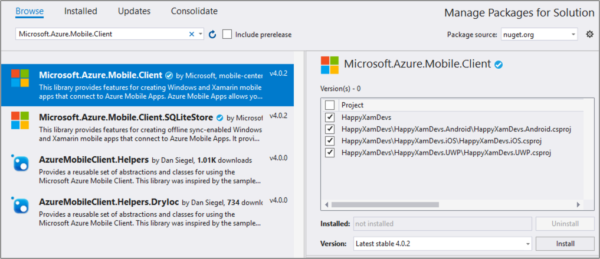

# Create Mobile App Azure Service

Now that our Azure Function App is configured for authentication, we will implement authentication inside our mobile app. 

We'll be using the [Microsoft.Azure.Mobile.Client](https://www.nuget.org/packages/Microsoft.Azure.Mobile.Client/) NuGet package to help with authentication, as well as to call Azure Functions as an authenticated user.

## 1. Installing NuGet Packages

1. Open our newly created Xamarin.Forms app in Visual Studio

2. (PC) In Visual Studio, right-click the `HappyXamDevs` solution > **Manage NuGet Packages For Solution..**

    - (Mac) In Visual Studio for Mac, right-click the `HappyXamDevs` project > **Add** > **Add NuGet Packages**

3. (PC) In the **NuGet Package Manager** window, select **Browse**

    - (Mac) _Skip this step_

4. In the **NuGet Package Manager** window, in the search bar, enter **Microsoft.Azure.Mobile.Client**

5. In the **NuGet Package Manager** window, in the search results, select **Microsoft.Azure.Mobile.Client**

6. (PC) In the **NuGet Package Manager** window, select **Install**



- (Mac) In the **NuGet Package Manager** window, select **Add Package**


7. (PC) _Skip this step_

    - (Mac) In Visual Studio for Mac, right-click the **HappyXamDevs.Android** project > **Add** > **Add NuGet Packages**

8. (PC) _Skip this step_

    - (Mac) In the **NuGet Package Manager** window, in the search results, select **Microsoft.Azure.Mobile.Client**


9. (PC) _Skip this step_

    - (Mac) In the **NuGet Package Manager** window, select **Add Package**

10. (PC) _Skip this step_

    - (Mac) In Visual Studio for Mac, right-click the **HappyXamDevs.iOS** project > **Add** > **Add NuGet Packages**

11. (PC) _Skip this step_

    - (Mac) In the **NuGet Package Manager** window, in the search results, select **Microsoft.Azure.Mobile.Client**

12. (PC) _Skip this step_

    - (Mac) In the **NuGet Package Manager** window, select **Add Package**

## 2. Creating a cross-platform Azure service

1. In the Visual Studio Solution Explorer, right-click on the second-from-the-top **HappyXamDevs** option > **Add** > **New Folder**
    > **Warning:** Do not select **Add Solution Folder**. If you are given the option **Add Solution Folder**, you have right-clicked on top-most **HappyXamDevs** option.

2. In the Visual Studio Solution Explorer, name the new folder `Services`

3. (PC) In the Visual Studio Solution Explorer, right-click on the newly created **Services** folder > **Add** > **Class**

    - (Mac) On Visual Studio for Mac, right-click on the newly created `Services` folder > **Add** > **New File**

4. In the **Add New Item** window, name the file `IAzureService.cs`

5. (PC) In the **Add New Item** window, click **Add**
    - (Mac) In the **Add New Item** window, click **New**

6. In the `IAzureService.cs` editor, add the following code:

```csharp
using System.Threading.Tasks;

namespace HappyXamDevs.Services
{
    public interface IAzureService
    {
        bool IsLoggedIn();
        Task<bool> Authenticate();
    }
}
```

> **Note:** `IsLoggedIn` will return `true` if there is currently a user logged in, `false` if not

> **Note:** `Authenticate` will return `true` if the user is successfully authenticated and `false` if not. This will be an asynchronous method, so the return value will be wrapped in a `System.Threading.Tasks.Task`. 

7. In the Visual Studio Solution Explorer, right-click on **Services** folder > **Add** > **Class**

    - (Mac) On Visual Studio for Mac, right-click on the **Services** folder > **Add** > **New File**

8. In the **Add New Item** window, name the file `AzureServiceBase.cs`

9. (PC) In the **Add New Item** window, click **Add**
    - (Mac) In the **Add New Item** window, click **New**

10. In the `AzureServiceBase.cs` editor, add the following code
    > **Note:** Replace `[Your Function App Name]` with the name of your Azure Function App, e.g. `HappyXamDevsFunction-Minnick`

```csharp
using System;
using System.Threading.Tasks;
using Microsoft.WindowsAzure.MobileServices;

namespace HappyXamDevs.Services
{
    public abstract class AzureServiceBase : IAzureService
    {
        protected const string AzureAppName = "[Your Function App Name]";
        protected readonly static string FunctionAppUrl = $"https://{AzureAppName}.azurewebsites.net";

        protected AzureServiceBase()
        {
            Client = new MobileServiceClient(FunctionAppUrl);
        }

        public MobileServiceClient Client { get; }

        public bool IsLoggedIn()
        {
            return Client.CurrentUser != null;
        }

        public async Task<bool> Authenticate()
        {
            if (IsLoggedIn())
                return true;

            try
            {
                await AuthenticateUser();
            }
            catch (InvalidOperationException)
            {
                return false;
            }

            return IsLoggedIn();
        }

        protected abstract Task AuthenticateUser();
    }
}
```

> **About The Code** 
>
>`string AzureAppName` and `string FunctionAppUrl` will be used in the platform-specific projects to connect to your Function back end
>
> `MobileServiceClient Client` provides APIs for authentication, information about the current user, and back-end services
>
> `bool IsLoggedIn()` verifies that `Client` has a valid current user
>
> `abstract Task AuthenticateUser()` will be implemented in our Android, iOS and/or UWP projects later
>
> `Task<bool> Authenticate()` first checks to see if there already is a logged in user, and if not call the `AuthenticateUser()` 

## Next step

The next step is to implement the platform-specific code to launch a web view to allow the user to authenticate with Facebook. You can see these steps here:

* [For Android](./3_1-CreateAnAzureServiceInTheMobileAppDroid.md)
* [For iOS](./3_2-CreateAnAzureServiceInTheMobileAppIos.md)
* [For Windows](./3_3-CreateAnAzureServiceInTheMobileAppWin.md)
