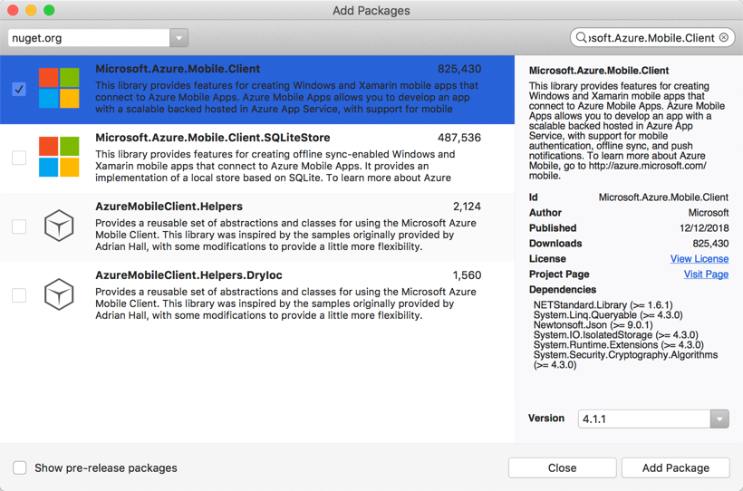

# Create Mobile App Azure Service

Now that our Azure Function App is configured, we will implement a service in the mobile app to call the function app.

We'll be using the [Microsoft.Azure.Mobile.Client](https://www.nuget.org/packages/Microsoft.Azure.Mobile.Client/) NuGet package to call Azure Functions.

> This package can support adding an authentication flow to your mobile app using Facebook, Twitter or Microsoft Auth. You can read more about this in the [App Service docs](https://docs.microsoft.com/en-gb/azure/app-service/configure-authentication-provider-facebook).

## 1. Installing NuGet Packages

### PC

1. In Visual Studio, right-click the `HappyXamDevs` solution > **Manage NuGet Packages For Solution..**
1. In the **NuGet Package Manager** window, select **Browse**
1. In the **NuGet Package Manager** window, in the search bar, enter **Microsoft.Azure.Mobile.Client**
1. In the **NuGet Package Manager** window, in the search results, select **Microsoft.Azure.Mobile.Client**
1. In the **NuGet Package Manager** window, select **Install**

    

### Mac

1. In Visual Studio for Mac, right-click the `HappyXamDevs` project > **Add** > **Add NuGet Packages**

1. In the **NuGet Package Manager** window, in the search bar, enter **Microsoft.Azure.Mobile.Client**

1. In the **NuGet Package Manager** window, in the search results, select **Microsoft.Azure.Mobile.Client**

1. In the **NuGet Package Manager** window, select **Add Package**

    

1. You will see a licence agreement dialog, accept the licence to continue.

1. Repeat the above steps for the `HappyXamDevs.Android` and `HappyXamDevs.iOS` projects

## 2. Creating a folder in the cross-platform project

1. In the Visual Studio Solution Explorer, right-click on the **HappyXamDevs** project > **Add** > **New Folder**
    > **Warning:** Do not select **Add Solution Folder**. If you are given the option **Add Solution Folder**, you have right-clicked on the **HappyXamDevs** solution, not the project.

1. In the Visual Studio Solution Explorer, name the new folder `Services`

## 3. Creating a cross-platform Azure service interface

### Creating the file

#### PC

1. In the Visual Studio Solution Explorer, right-click on the newly created **Services** folder > **Add** > **Class**

2. In the **Add New Item** window, name the file `IAzureService.cs`

3. In the **Add New Item** window, click **Add**

#### Mac

1. On Visual Studio for Mac, right-click on the newly created `Services` folder > **Add** > **New File**

2. In the **New File** window, select **General -> Empty Interface**

3. Name the file `IAzureService.cs`

4. Click **New**

## 4. Creating a cross-platform Azure service to implement this interface

### Creating the file

#### PC

1. In the Visual Studio Solution Explorer, right-click on the newly created **Services** folder > **Add** > **Class**

2. In the **Add New Item** window, name the file `AzureService.cs`

3. In the **Add New Item** window, click **Add**

#### Mac

1. On Visual Studio for Mac, right-click on the newly created `Services` folder > **Add** > **New File**

2. In the **New File** window, select **General -> Empty Class**

3. Name the file `AzureService.cs`

4. Click **New**

### Adding the code

1. In the `AzureService.cs` editor, add the following code
    > **Note:** Replace `[Your Function App Name]` with the name of your Azure Function App, e.g. `HappyXamDevsFunction-Minnick`

   ```csharp
   using System;
   using System.Threading.Tasks;
   using Microsoft.WindowsAzure.MobileServices;

   [assembly: Xamarin.Forms.Dependency(typeof(HappyXamDevs.Services.AzureService))]

   namespace HappyXamDevs.Services
   {
       public class AzureService : IAzureService
       {
           protected const string AzureAppName = "[Your Function App Name]";
           protected readonly static string FunctionAppUrl = $"https://{AzureAppName}.azurewebsites.net";

           public AzureService()
           {
               Client = new MobileServiceClient(FunctionAppUrl);
           }

           public MobileServiceClient Client { get; }
       }
   }
   ```

   > **About The Code**
   >
   > `Xamarin.Forms.Dependency` registers this class with the dependency service
   >
   >`string AzureAppName` and `string FunctionAppUrl` will be used to connect to your Function back end
   >
   > `MobileServiceClient Client` provides APIs for back-end services

## Next step

Now that your Azure service has been created, the next step is to [wire up the camera using a Xamarin plugin](./4-WireUpTheCamera.md).