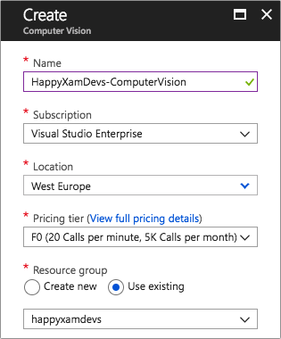
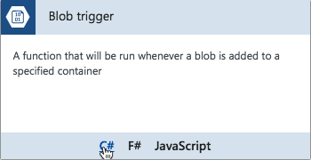
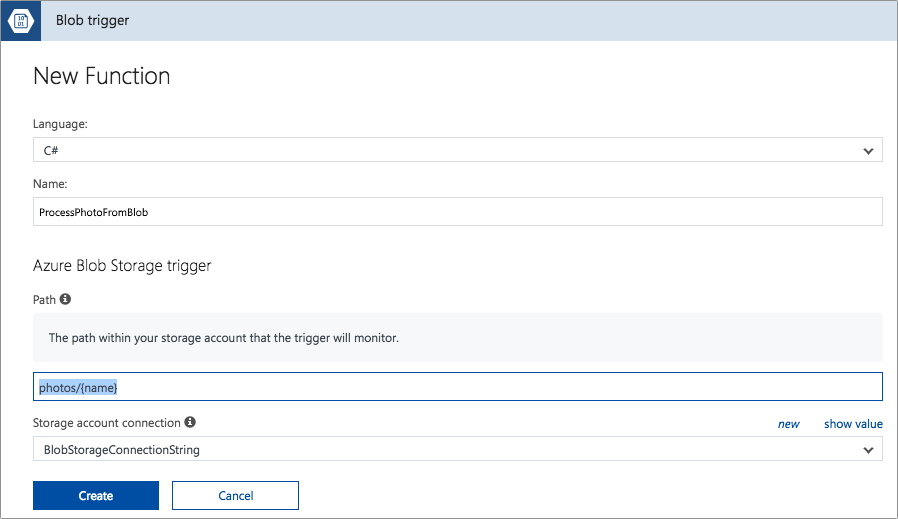

# Creating a Blob storage trigger to create metadata about the image

In the previous step you uploaded an image to Blob storage using an Azure Function. In this step you will create a trigger against the Blob storage that runs every time a new Blob is added or an existing Blob is updated, and this trigger will use the [Azure Cognitive Services Computer Vision API](https://docs.microsoft.com/azure/cognitive-services/computer-vision/home/?WT.mc_id=mobileappsoftomorrow-workshop-jabenn) to generate an image description and some tags around what is in the photo, then upload this data to Cosmos DB.

## Configuring Computer Vision in the Azure portal

Before you can use the Computer Vision API, you will need an API key. You can get this by creating a resource in the Azure portal.

1. From the [Azure Portal](https://portal.azure.com/?WT.mc_id=mobileappsoftomorrow-workshop-jabenn), add a new resource. Search for "Computer Vision" and select _Computer Vision_ from the _AI + Machine Learning_ category. Then click "Create".

    

2. In the _Create_ blade, enter a name for the service, such as "HappyXamDevs-ComputerVision", select your Azure subscription, and select the Azure region closest to you. For the _Pricing tier_, set this to "F0", a free tier with limited calls but well within what we need for this workshop (at the time of writing this is limited to 20 per minute, and 5,000 per month). For the _Resource Group_, select "Use Existing" and choose the resource group you created when setting up your function app. Then check _Pin to Dashboard_ to make this easy to find and click "Create".

    

3. Once the Computer Vision resource has been created, head to it and select _Resource Management->Keys_ from the left-hand menu. Copy one of the API keys.
4. Head your Azure Functions app, open the _Application Settings_ from the link on the _Overview_ page and add a new application setting called "ComputerVisionApiKey", and set the value to be the Computer Vision resource API key. The Click "Save" on top of the page.

## Creating a Blob trigger Azure Function

In a previous part, you created an Azure Function with an HTTP trigger - a call to an HTTP end point would invoke that function. You can also create functions that are triggered when blobs are [saved into blob storage](https://docs.microsoft.com/azure/azure-functions/functions-create-storage-blob-triggered-function/?WT.mc_id=mobileappsoftomorrow-workshop-jabenn), just like the way a database trigger is fired on an INSERT in a traditional relational database like SQL Server.

Functions can also have bindings to other Azure resources such as storage and Cosmos DB. These bindings can be input bindings so that data from the resource is passed to the function as an input parameter, or output bindings so that data returned from the function or passed as an `out` parameter can be sent to a resource. For example, you can bind the return value of a function to a Cosmos DB database and have the returned value inserted as a document into the database once the function completes, simply by configuring the bindings.

### Creating the Blob trigger

1. Open the Azure Portal and head to your Azure Functions app. Click the _+_ next to _Functions_ in the left-hand menu.
2. Scroll down to the _Blob Trigger_ panel and click on _C#_.

    

3. In the _Function_ section, leave the _Language_ as C#, set the _Name_ to be "ProcessPhotoFromBlob".
4. In the _Azure Blob Storage Trigger_ section you need to configure the collection that the trigger will listen on. Set this to `photos/{name}`. This tells the trigger to listen on any inserted or updated blobs in the `photos` collection, and pass the blob file name into the function as a parameter called `name`. Finally set the _Storage account connection_ to the "BlobStorageConnectionString" connection string you created earlier.
5. Click "Create" to create the trigger Function.

    

### Analyzing the photo using the Computer Vision API

The purpose of this function is to analyze the photo uploaded to blob storage using the Azure Computer Vision API. This function will return an object containing the results of this analysis which you will eventually bind to Cosmos DB.

1. To use the computer vision API in your Azure Function, you will need to use the pre-release "Microsoft.Azure.CognitiveServices.Vision.ComputerVision" NuGet package. To add this NuGet package you will need to add a new file called `project.json` to the Function. Select _View Files_ from the right-hand side, click the "Add" button, enter "project.json" as the file name and press return.
2. This file will open in the editor, so add the following to add the ""Microsoft.Azure.CognitiveServices.Vision.ComputerVision" NuGet package to the function. The click "Save".

    ```json
    {
        "frameworks": {
            "net46":{
                "dependencies": {
                    "Microsoft.Azure.CognitiveServices.Vision.ComputerVision": "1.0.2-preview"
                }
            }
        }
    }
    ```

3. From the _View Files_ pane, select the _run.csx_ file. You will see a `Run` method with three parameters:
    * `myBlob` - this is the newly inserted or updated blob that caused the trigger to be fired.
    * `name` - this is the file name of the blob.
    * `log` - a logger.

4. This `Run` method needs to be async and return an object that you can eventually bind to Cosmos DB, so change the return type in the signature from `void` to `async Task<object>`.

5. Start by adding code to this function to retrieve the API key from the application configuration. You will need to add a using directive to the top of the file for the `System.Configuration` namespace.

    ```cs
    var apiKey = ConfigurationManager.AppSettings["ComputerVisionApiKey"];
    ```

6. Create some API key credentials using this api key, and use these credentials to instantiate the Computer Vision API. Set the `AzureRegion` to match the one you used when you created the resource. You will need to add a using directive for the `Microsoft.Azure.CognitiveServices.Vision.ComputerVision` namespace.

    ```cs
    var creds = new ApiKeyServiceClientCredentials(apiKey);
    var visionApi = new ComputerVisionAPI(creds)
    {
        AzureRegion = AzureRegions.Westeurope
    };
    ```

7. The API to analyze an image can return multiple pieces of information about the image. For this app, you only want to get a description and some tags for the photo, so create a list of the features you want and pass them to the `AnalyzeImageInStreamWithHttpMessagesAsync` method on the Computer Vision API, along with the blob data. You will need to add a using directive for the `Microsoft.Azure.CognitiveServices.Vision.ComputerVision.Models` namespace.

    ```cs
    var features = new List<VisualFeatureTypes>
    {
        VisualFeatureTypes.Description,
        VisualFeatureTypes.Tags
    };
    var analysis = await visionApi.AnalyzeImageInStreamWithHttpMessagesAsync(myBlob, features);
    ```

8. Return an new anonymous type containing the blob name, the description and the tags from the Computer Vision analysis. You will need to add a using directive for the `using System.Linq;` namespace.  Then save the function.

    ```cs
    return new
    {
        Name = name,
        Tags = analysis.Body.Tags.Select(t => t.Name).ToArray(),
        Caption = analysis.Body.Description.Captions.FirstOrDefault()?.Text ?? ""
    };
    ```

The full code for this function script file is shown below.

```cs
using System.Configuration;
using System.Linq;
using Microsoft.Azure.CognitiveServices.Vision.ComputerVision;
using Microsoft.Azure.CognitiveServices.Vision.ComputerVision.Models;

public static async Task Run(Stream myBlob, string name, TraceWriter log)
{
    var apiKey = ConfigurationManager.AppSettings["ComputerVisionApiKey"];
    var creds = new ApiKeyServiceClientCredentials(apiKey);
    var visionApi = new ComputerVisionAPI(creds)
    {
        AzureRegion = AzureRegions.Westeurope
    };

    var features = new List<VisualFeatureTypes>
    {
        VisualFeatureTypes.Description,
        VisualFeatureTypes.Tags
    };
    var analysis = await visionApi.AnalyzeImageInStreamWithHttpMessagesAsync(myBlob, features);

    return new
    {
        Name = name,
        Tags = analysis.Body.Tags.Select(t => t.Name).ToArray(),
        Caption = analysis.Body.Description.Captions.FirstOrDefault()?.Text ?? ""
    };
}
```

### Setting up an output binding to Cosmos DB

Now that you have a function that returns an object with the results of the vision analysis, you will need to bind this output to your Cosmos DB database. Once this binding is set up, every time this trigger runs the returned object will be saved as a JSON document inside your Cosmos DB instance.

1. Under the _ProcessPhotoFromBlob_ node in the left-hand menu, select the _Integrate_ node. You will see the Blob trigger you set up, with nothing configured as input or output bindings.
2. Under _Outputs_, click the "+ New Output" button. Select _Azure Cosmos DB_ and click "Select".
3. For the _Document parameter name_, check the _Use function return value_ option.
4. Set the database name to be "Photos" and collection name to be "PhotoMetadata".
5. Leave the _Partition key_ blank.
6. For the _Azure Cosmos DB Account connection_, click the _new_ option to configure a new connection string. The select your Cosmos DB resource from the list that appears.
7. Click "Save".

    

## Testing it all out

To verify this is working, launch the mobile app on your platform of choice and upload a photo. From the Azure Portal, head to your Cosmos DB resource, and select the _Data Explorer_ from the left-hand menu. From there expand the _Photos_ database and the _PhotosMetadata_ collection and select _Documents_. You should see the new document in the main pane, and when you select it you will see the JSON for this document, showing the Blob name, as well as the caption and tags for this photo from the Computer Vision API.


## Next step

Now that you have photos in Blob storage and photo metadata in Cosmos DB, the next step is to [create some Azure Functions to retrieve the photos](./10-FunctionToLoadPhotos.md).